## 常见技术场景

### 1.单点登录这块怎么实现的

#### 1.1 概述

单点登录的英文名叫做：Single Sign On（简称**SSO**）,只需要登录一次，就可以访问所有信任的应用系统

在**以前**的时候，一般我们就**单系统**，所有的功能都在同一个系统上。

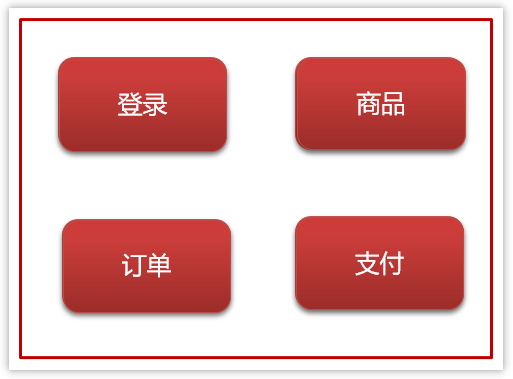

单体系统的session共享

- **登录**：将用户信息保存在Session对象中

- - 如果在Session对象中能查到，说明已经登录
  - 如果在Session对象中查不到，说明没登录（或者已经退出了登录）

- **注销（退出登录）**：从Session中删除用户的信息

后来，我们为了**合理利用资源和降低耦合性**，于是把单系统**拆分**成多个子系统。


多系统即可能有多个Tomcat，而Session是依赖当前系统的Tomcat，所以系统A的Session和系统B的Session是**不共享**的。

解决系统之间Session不共享问题有一下几种方案：

- Tomcat集群Session全局复制（最多支持5台tomcat，不推荐使用）
- JWT(常见)
- Oauth2
- CAS
- 自己实现（redis+token）

#### 1.2 JWT解决单点登录

现在有一个微服务的简单架构，如图：

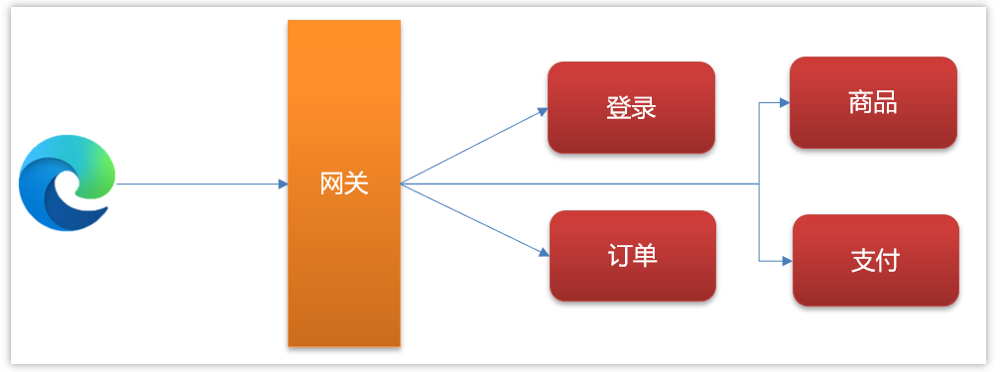

使用jwt解决单点登录的流程如下：


#### 1.3 回答要点

1，先解释什么是单点登录

单点登录的英文名叫做：Single Sign On（简称**SSO**）

2，介绍自己项目中涉及到的单点登录（即使没涉及过，也可以说实现的思路）

3，介绍单点登录的解决方案，以JWT为例

​	   I.  用户访问其他系统，会在网关判断token是否有效

​     II.  如果token无效则会返回401（认证失败）前端跳转到登录页面

​    III.  用户发送登录请求，返回浏览器一个token，浏览器把token保存到cookie

​    IV.  再去访问其他服务的时候，都需要携带token，由网关统一验证后路由到目标服务

### 2.权限认证是如何实现的

#### 2.1 概述

后台的管理系统，更注重权限控制，最常见的就是RBAC模型来指导实现权限

RBAC(Role-Based Access Control)基于角色的访问控制

- 3个基础部分组成：用户、角色、权限

- 具体实现
  - 5张表（用户表、角色表、权限表、用户角色中间表、角色权限中间表）
  - 7张表（用户表、角色表、权限表、菜单表、用户角色中间表、角色权限中间表、权限菜单中间表）

#### 2.2 RBAC权限模型

最常见的5张表的关系

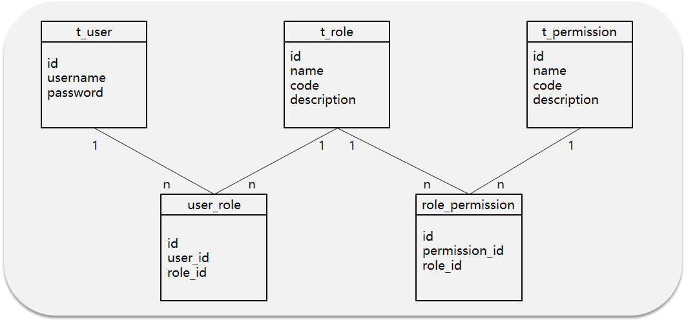

**数据流转**

张三具有什么权限呢？

流程：张三登录系统---> 查询张三拥有的角色列表--->再根据角色查询拥有的权限

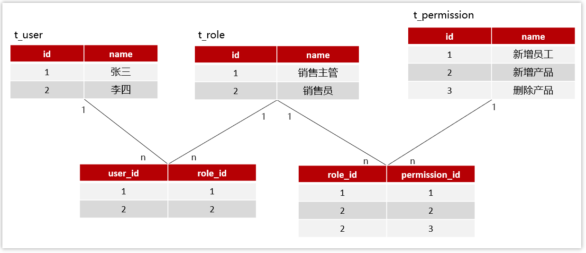

在实际的开发中，也会使用权限框架完成权限功能的实现，并且设置多种粒度，常见的框架有：

- Apache shiro  
- Spring security（推荐）

#### 2.3 回答要点

- 后台管理系统的开发经验

- 介绍RBAC权限模型5张表的关系（用户、角色、权限）

- 权限框架：Spring security

### 3.上传数据的安全性你们怎么控制？

#### 3.1 概述

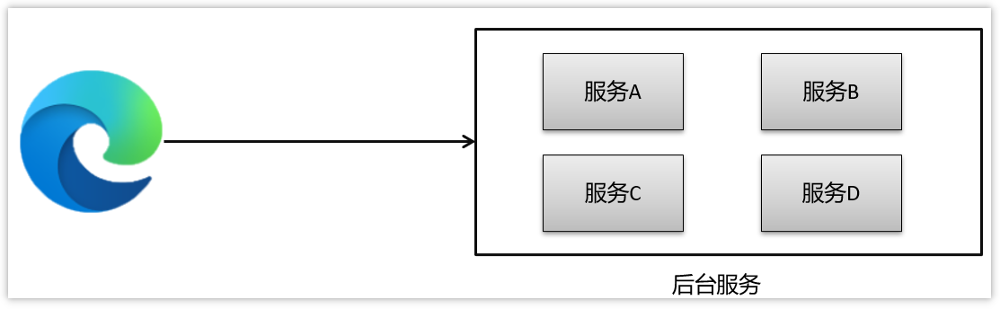

>这里的安全性，主要说的是，浏览器访问后台，需要经过网络传输，有可能会出现安全的问题

解决方案：使用非对称加密（或对称加密），给前端一个公钥让他把数据加密后传到后台，后台负责解密后处理数据

#### 3.2 对称加密

文件加密和解密使用相同的密钥，即加密密钥也可以用作解密密钥

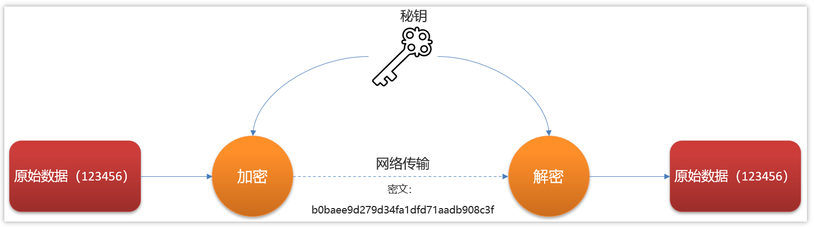

- 数据发信方将明文和加密密钥一起经过特殊的加密算法处理后，使其变成复杂的加密密文发送出去，

- 收信方收到密文后，若想解读出原文，则需要使用加密时用的密钥以及相同加密算法的逆算法对密文进行解密，才能使其回复成可读明文。
- 在对称加密算法中，使用的密钥只有一个，收发双方都使用这个密钥，这就需要解密方事先知道加密密钥。

**优点:**  对称加密算法的优点是算法公开、计算量小、加密速度快、加密效率高。

**缺点:**  没有非对称加密安全.

**用途：** 一般用于保存用户手机号、身份证等敏感但能解密的信息。

**常见的对称加密算法有**: `AES、DES、3DES、Blowfish、IDEA、RC4、RC5、RC6、HS256 `

#### 3.3 非对称加密

两个密钥：公开密钥（publickey）和私有密钥，公有密钥加密，私有密钥解密

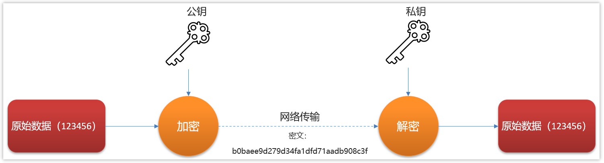

解释:  同时生成两把密钥：私钥和公钥，私钥隐秘保存，公钥可以下发给信任客户端.

加密与解密:

- 私钥加密，持有公钥才可以解密
- 公钥加密，持有私钥才可解密

签名:

- 私钥签名,  持有公钥进行验证是否被篡改过.

**优点: ** 非对称加密与对称加密相比，其安全性更好；

**缺点:**  非对称加密的缺点是加密和解密花费时间长、速度慢，只适合对少量数据进行加密。
**用途：** 一般用于签名和认证。私钥服务器保存, 用来加密,  公钥客户拿着用于对于令牌或者签名的解密或者校验使用.

**常见的非对称加密算法有：** RSA、DSA（数字签名用）、ECC（移动设备用）、RS256 (采用SHA-256 的 RSA 签名) 

#### 3.4 回答要点

- 使用非对称加密（或对称加密），给前端一个公钥让他把数据加密后传到后台，后台解密后处理数据
  - 传输的数据很大建议使用对称加密，不过不能保存敏感信息
  - 传输的数据较小，要求安全性高，建议采用非对称加密

### 4.你负责项目的时候遇到了哪些比较棘手的问题

这个面试题主要考察的是，

- 你是否有过开发经验
- 是否是核心开发人员

有4个方面可以回答，只要挑出一个回答就行了

**（1）设计模式**

- 工厂模式+策略
- 责任链模式

>回答思路
>
>1，什么背景（技术问题）
>
>2，过程（解决问题的过程）
>
>3，最终落地方案

举例：

①：介绍登录业务（一开始没有用设计模式，所有的登录方式都柔和在一个业务类中，不过，发现需求经常改）

②：登录方式经常会增加或更换，每次都要修改业务层代码，所以，经过我的设计，使用了工厂设计模式和策略模式，解决了，经常修改业务层代码的问题

③：详细介绍一下工厂模式和策略模式（参考前面设计模式的课程）

**（2）线上BUG**

- CPU飙高
- 内存泄漏
- 线程死锁
- ....

回答方式参考上面的回答思路，具体问题可以参考前面的课程（JVM和多线程相关的面试题）

**（3）调优**

- 慢接口
- 慢SQL
- 缓存方案

**（4）组件封装**

- 分布式锁
- 接口幂等
- 分布式事务
- 支付通用


### 5.你们项目中日志怎么采集的

#### 5.1 问题

1，为什么要采集日志？

日志是定位系统问题的重要手段，可以根据日志信息快速定位系统中的问题

2，采集日志的方式有哪些?

- ELK：即Elasticsearch、Logstash和Kibana三个软件的首字母

- 常规采集：按天保存到一个日志文件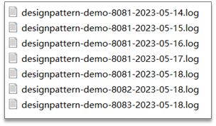

#### 5.2 ELK基本架构

ELK即Elasticsearch、Logstash和Kibana三个开源软件的缩写

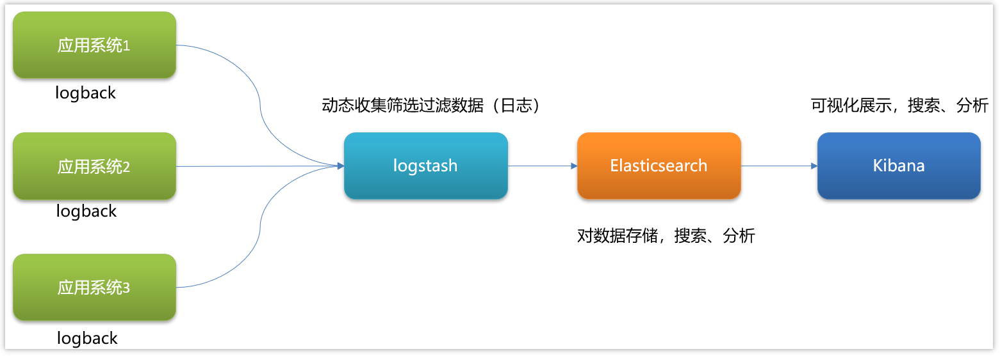

- Elasticsearch
  Elasticsearch  全文搜索和分析引擎，对大容量的数据进行接近实时的存储、搜索和分析操作。

- Logstash
  Logstash是一个数据收集引擎，它可以动态的从各种数据源搜集数据，并对数据进行过滤、分析和统一格式等操作，并将输出结果存储到指定位置上

- Kibana
  Kibana是一个数据分析和可视化平台，通常与Elasticsearch配合使用，用于对其中的数据进行搜索、分析，并且以统计图标的形式展示。

#### 5.3 参考回答

- 我们搭建了ELK日志采集系统

- 介绍ELK的三个组件：
  - Elasticsearch是全文搜索分析引擎，可以对数据存储、搜索、分析
  - Logstash是一个数据收集引擎，可以动态收集数据，可以对数据进行过滤、分析，将数据存储到指定的位置
  - Kibana是一个数据分析和可视化平台，配合Elasticsearch对数据进行搜索，分析，图表化展示

### 6.查看日志的命令

目前采集日志的方式：按天保存到一个日志文件

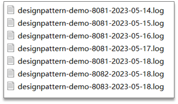

也可以在logback配置文件中设置日志的目录和名字

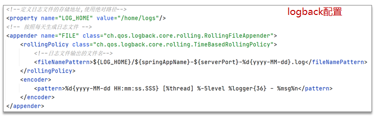


需要掌握的Linux中的日志：

- 实时监控日志的变化

  实时监控某一个日志文件的变化：tail -f xx.log；实时监控日志最后100行日志： tail –n 100 -f xx.log

- 按照行号查询

  - 查询日志尾部最后100行日志：tail – n 100 xx.log

  - 查询日志头部开始100行日志：head –n 100 xx.log

  - 查询某一个日志行号区间：cat -n xx.log | tail -n +100 | head -n 100 (查询100行至200行的日志)

- 按照关键字找日志的信息

  查询日志文件中包含debug的日志行号：cat -n xx.log | grep "debug"

- 按照日期查询

  sed -n '/2023-05-18 14:22:31.070/,/ 2023-05-18 14:27:14.158/p’xx.log 

- 日志太多，处理方式

  - 分页查询日志信息：cat -n xx.log |grep "debug" | more

  - 筛选过滤以后，输出到一个文件：cat -n xx.log | grep "debug" >debug.txt  

### 7.生产问题怎么排查

已经上线的bug排查的思路：

1，先分析日志，通常在业务中都会有日志的记录，或者查看系统日志，或者查看日志文件，然后定位问题

2，远程debug(通常公司的正式环境（生产环境）是不允许远程debug的。一般远程debug都是公司的测试环境，方便调试代码)

**远程debug配置**

前提条件：**远程的代码和本地的代码要保持一致**

1.远程代码需要配置启动参数，把项目打包放到服务器后启动项目的参数：

```shell
java -jar -agentlib:jdwp=transport=dt_socket,server=y,suspend=n,address=5005 project-1.0-SNAPSHOT.jar
```

>**-agentlib:jdwp**  是通知JVM使用(java debug wire protocol)来运行调试环境
>
>**transport=dt_socket**  调试数据的传送方式
>
>**server=y**  参数是指是否支持在server模式
>
>**suspend=n** 是否在调试客户端建立起来后，再执行JVM。
>
>**address=5005**  调试端口设置为5005，其它端口也可以

2.idea中设置远程debug，找到idea中的 Edit Configurations...

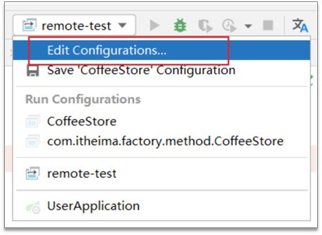

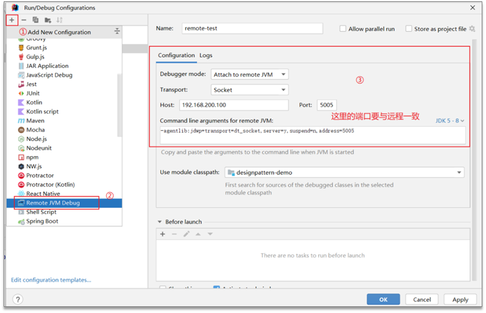

3. idea中启动远程debug
4. 访问远程服务器，在本地代码中打断点即可调试远程

### 8.怎么快速定位系统的瓶颈

- 压测（性能测试），项目上线之前测评系统的压力
  - 压测目的：给出系统当前的性能状况；定位系统性能瓶颈或潜在性能瓶颈
  - 指标：响应时间、 QPS、并发数、吞吐量、 CPU利用率、内存使用率、磁盘IO、错误率
  - 压测工具：LoadRunner、Apache Jmeter …
  - 后端工程师：根据压测的结果进行解决或调优（接口慢、代码报错、并发达不到要求…）

- 监控工具、链路追踪工具，项目上线之后监控
  - 监控工具：Prometheus+Grafana
  - 链路追踪工具：skywalking、Zipkin

- 线上诊断工具Arthas(阿尔萨斯)，项目上线之后监控、排查

  - 官网：https://arthas.aliyun.com/

  - 核心功能：

    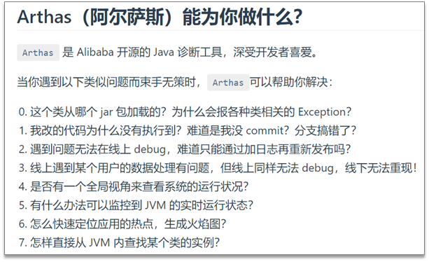

    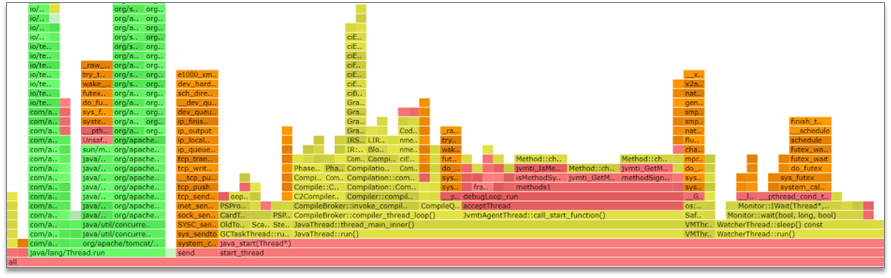

