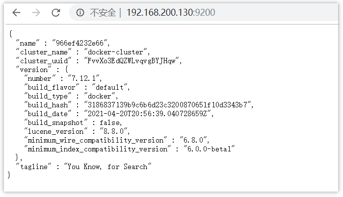
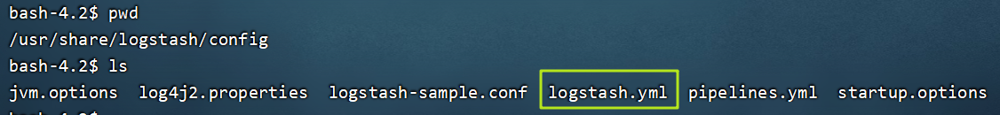
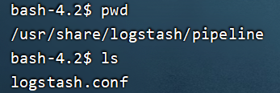
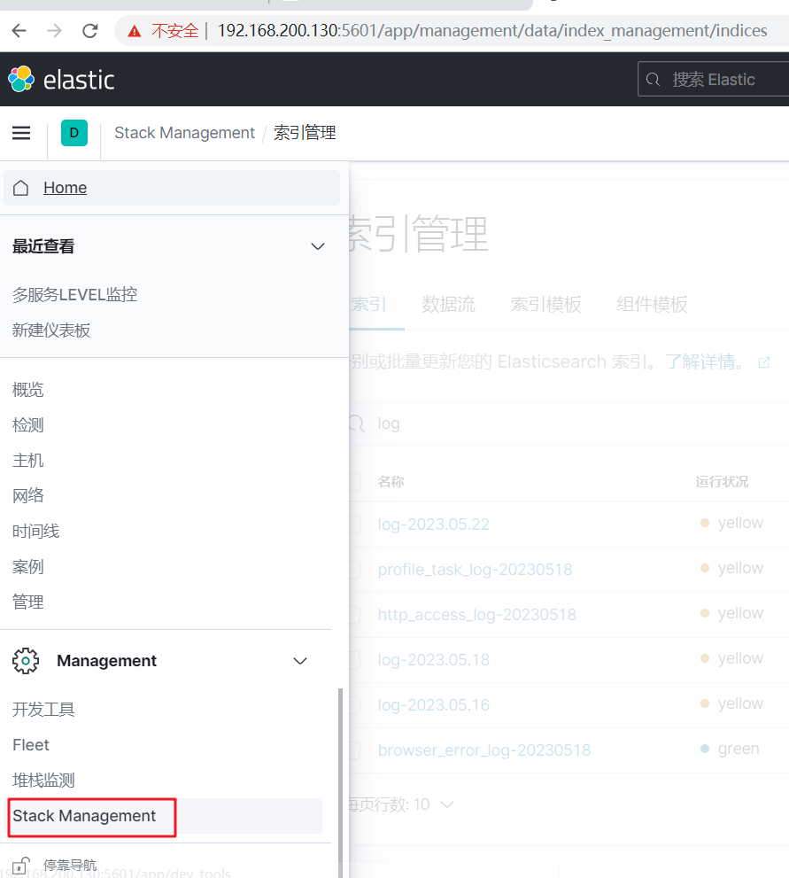
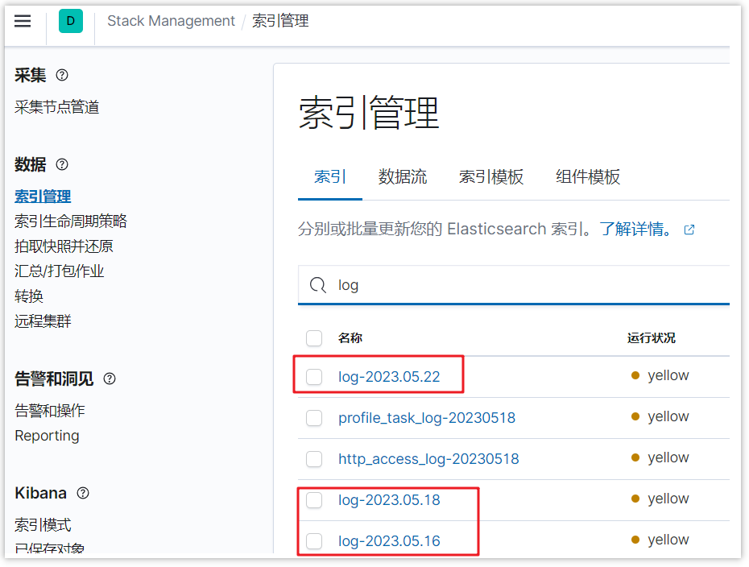
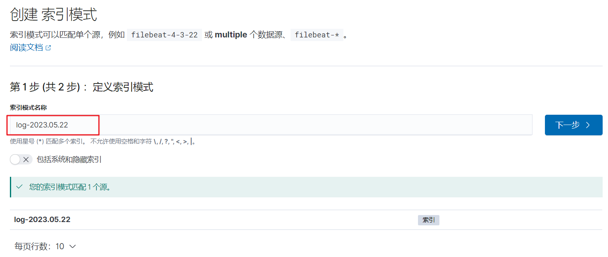
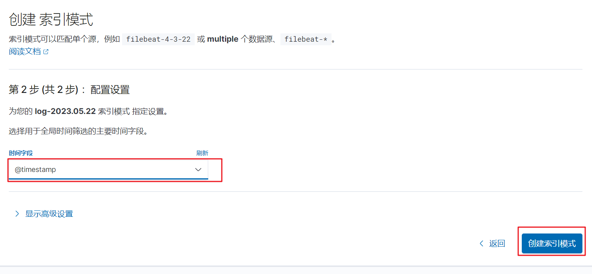
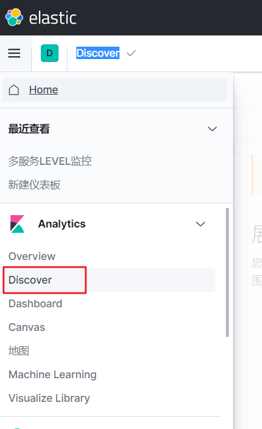
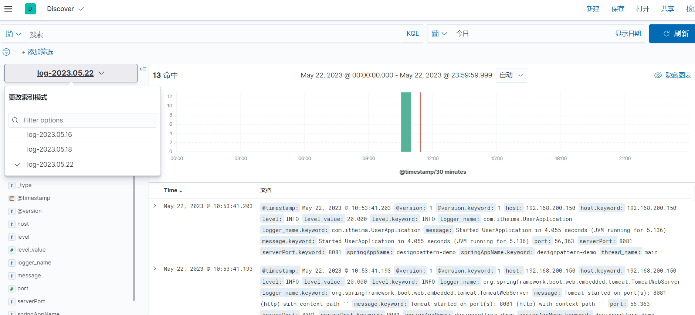

# ELK搭建

## 前言

1.需要准备一台linux服务器（最好是CentOS7）,内存至少4g以上（三个组件都比较占用内存）

2.需要有docker使用经验

## 1 docker安装ElasticSearch

这里先创建一个网络：因为我们还需要部署kibana容器、logstash容器，需要让这些容器互联。

```shell
docker network create elk-net
```

这里ElasticSearch采用的是7.12.1版本

在docker中搜索和下载对应的镜像

```shell
#搜索镜像
docker search elasticsearch
#下载镜像
docker pull elasticsearch:7.12.1
```

有了镜像以后，可以直接创建对应的容器，命令如下：

```shell
docker run -d \
	--name es \
    -e "ES_JAVA_OPTS=-Xms512m -Xmx512m" \
    -e "discovery.type=single-node" \
    -v es-data:/usr/share/elasticsearch/data \
    -v es-plugins:/usr/share/elasticsearch/plugins \
    --privileged \
    --network elk-net \
    -p 9200:9200 \
    -p 9300:9300 \
elasticsearch:7.12.1
```

命令解释：

- `-e "cluster.name=es-docker-cluster"`：设置集群名称
- `-e "http.host=0.0.0.0"`：监听的地址，可以外网访问
- `-e "ES_JAVA_OPTS=-Xms512m -Xmx512m"`：内存大小
- `-e "discovery.type=single-node"`：非集群模式
- `-v es-data:/usr/share/elasticsearch/data`：挂载逻辑卷，绑定es的数据目录
- `-v es-logs:/usr/share/elasticsearch/logs`：挂载逻辑卷，绑定es的日志目录
- `-v es-plugins:/usr/share/elasticsearch/plugins`：挂载逻辑卷，绑定es的插件目录
- `--privileged`：授予逻辑卷访问权
- `--network elk-net` ：加入一个名为es-net的网络中
- `-p 9200:9200`：端口映射配置

在浏览器中输入：http://192.168.200.130:9200 (按照自己的ip访问)即可看到elasticsearch的响应结果：



## 2 docker安装kibana

创建容器(如果不提前下载好，在创建容器时，会先下载，然后创建容器)

```shell
docker run -d \
--name kibana \
-e ELASTICSEARCH_HOSTS=http://es:9200 \
-e "I18N_LOCALE=zh-CN" \
--network=elk-net \
-p 5601:5601  \
kibana:7.12.1
```

- `--network elk-net` ：加入一个名为es-net的网络中，与elasticsearch在同一个网络中
- `-e ELASTICSEARCH_HOSTS=http://es:9200"`：设置elasticsearch的地址，因为kibana已经与elasticsearch在一个网络，因此可以用容器名直接访问elasticsearch
- `-p 5601:5601`：端口映射配置

此时，在浏览器输入地址访问：http://192.168.200.130:5601，即可看到结果


## 3 docker安装logstash

### 3.1 创建容器

```shell
docker run -d -p 5044:5044 -p 9600:9600 --name logstash --network=elk-net logstash:7.12.1
```

### 3.2 修改配置

#### 3.2.1 设置ES的地址

创建完容器之后，需要在容器修改一些配置

```shell
#进入容器
docker exec -it logstash /bin/bash
```

找到config目录中的logstatsh.yml文件



修改里面的内容，设置es服务的地址，如下

```yaml
http.host: "0.0.0.0"
xpack.monitoring.elasticsearch.hosts: [ "http://192.168.200.130:9200" ] #设置跟es的服务地址
```

### 3.2.2 设置logstash收集日志的输入和输出

进入容器

```shell
#进入容器
docker exec -it logstash /bin/bash
```

找到pipeline目录中的logstatsh.conf文件



修改如下，可以设置数据输入的方式，也可以设置把数据存放到哪里

```shell
input {
  tcp {
    mode => "server"
    host => "0.0.0.0"  # 允许任意主机发送日志
    port => 5044
    codec => json_lines    # 数据格式
  }
}

output {
  elasticsearch {
      hosts  => ["http://192.168.200.130:9200"]   # ElasticSearch 的地址和端口
      index  => "log-%{+YYYY.MM.dd}"         # 指定索引名,可以根据自己的需求指定命名
      codec  => "json"
  }
  stdout {
    codec => rubydebug
  }
}
```

修改完所有的配置后，需要重启logstash容器

```shell
docker restart logstash
```

## 4 应用系统对接logstash

在项目的pom文件中添加新的依赖

```xml
<dependency>
    <groupId>net.logstash.logback</groupId>
    <artifactId>logstash-logback-encoder</artifactId>
    <version>6.6</version>
</dependency>
```

目前，我们采用的logback来采集日志进行上报给logstash

需要在resources目录中新增一个文件logback-spring.xml(注意命名，不要修改)

```xml
<?xml version="1.0" encoding="UTF-8"?>
<configuration>
    <include resource="org/springframework/boot/logging/logback/base.xml" />
    <springProperty scope="context" name="springAppName" source="spring.application.name"/>
    <springProperty scope="context" name="serverPort" source="server.port"/>
    <appender name="LOGSTASH" class="net.logstash.logback.appender.LogstashTcpSocketAppender">
        <!--logstash的服务地址和端口，可以实际情况设置-->
        <destination>192.168.200.130:5044</destination>
        <!-- 日志输出编码 -->
        <encoder charset="UTF-8" class="net.logstash.logback.encoder.LogstashEncoder">
            <providers>
                <timestamp>
                    <timeZone>UTC</timeZone>
                </timestamp>
                <pattern>
                    <pattern>
                        {
                        <!--应用名称 -->
                        "app": "${springAppName}_${serverPort}",
                        <!--打印时间 -->
                        "timestamp": "%d{yyyy-MM-dd HH:mm:ss.SSS}",
                        <!--线程名称 -->
                        "thread": "%thread",
                        <!--日志级别 -->
                        "level": "%level",
                        <!--日志名称 -->
                        "logger_name": "%logger",
                        <!--日志信息 -->
                        "message": "%msg",
                        <!--日志堆栈 -->
                        "stack_trace": "%exception"
                        }
                    </pattern>
                </pattern>
            </providers>
        </encoder>
    </appender>
    <!--定义日志文件的存储地址,使用绝对路径-->
    <property name="LOG_HOME" value="/home/logs"/>
    <!-- 按照每天生成日志文件 -->
    <appender name="FILE" class="ch.qos.logback.core.rolling.RollingFileAppender">
        <rollingPolicy class="ch.qos.logback.core.rolling.TimeBasedRollingPolicy">
            <!--日志文件输出的文件名-->
            <fileNamePattern>${LOG_HOME}/${springAppName}-${serverPort}-%d{yyyy-MM-dd}.log</fileNamePattern>
        </rollingPolicy>
        <encoder>
            <pattern>%d{yyyy-MM-dd HH:mm:ss.SSS} [%thread] %-5level %logger{36} - %msg%n</pattern>
        </encoder>
    </appender>
    <root level="INFO">
        <appender-ref ref="LOGSTASH" />
        <appender-ref ref="FILE" />
        <appender-ref ref="CONSOLE" />
    </root>


</configuration>
```

也可以在专门在application.yml文件中设置logback配置的目录

```yaml
logging:
  config: classpath:logback-spring.xml
```

## 5 ELK基本使用

### 5.1 查看索引文件

对接项目之后，可以启动项目，产生一些日志数据

然后打开kibana，找到索引管理



可以直接查看已创建的日志索引



### 5.2 添加索引模式

如果想用kibana方便的查看日志的数据，可以添加索引模式，如下图


点击创建索引模式，输入想要管理的索引名称



点击下一步，添加筛选的字段，一般都是时间戳字段，最后点击创建索引模式



### 5.3 检索日志

打开Discover



检索日志，选择不同的索引，可以按照不同的字段检索，或者在输入框直接输入内容，也是可以的



